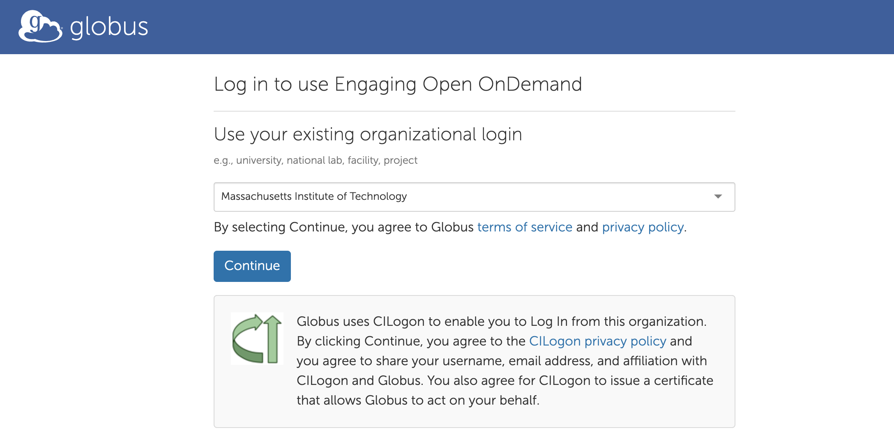
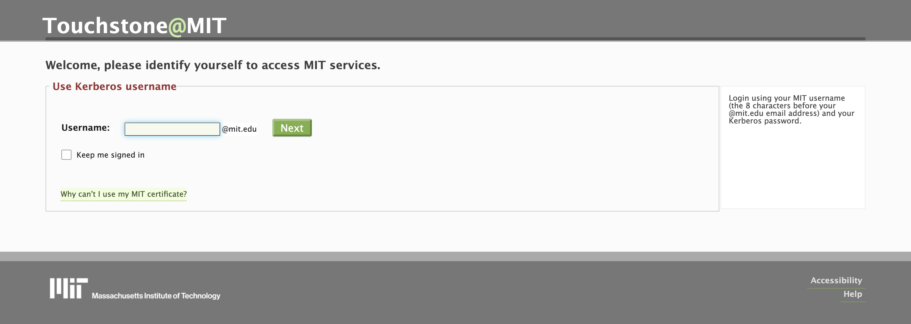
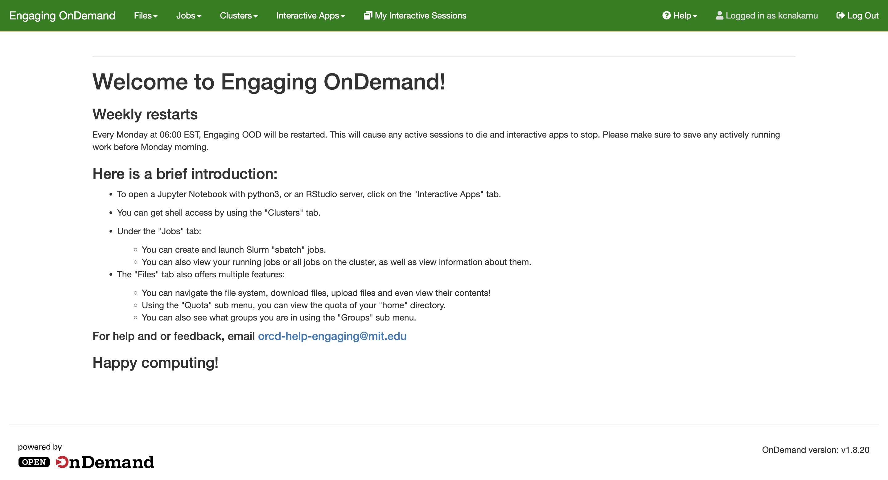

---
tags:
 - Logging in with OnDemand
---

# Logging in with OnDemand

OnDemand is a web portal used to access Engaging. This page provides instructions on how to log into the OnDemand portal. For logging into SuperCloud and OpenMind, please refer to the respective documentation:  

- [SuperCloud Documentation](https://mit-supercloud.github.io/supercloud-docs/web-portal/) and [Web Portal](https://txe1-portal.mit.edu)  
- [OpenMind Login Documentation](https://github.mit.edu/MGHPCC/openmind/wiki/Getting-started#login)

## Accessing the Web Portal

1. Navigate to [engaging-ood.mit.edu](https://engaging-ood.mit.edu) on your web browser. On the Engaging OnDemand login page, select the green `Login to Engaging Open OnDemand` button to authenticate with Globus. 

2. Under `Use your existing organization login`, select "Massachusetts Institute of Technology" and `Continue`. 
  
3. You will be redirected to the MIT Kerberos Login page. Enter your user ID and password.
 
4. After successful authentication, you should see the Engaging OnDemand dashboard.

