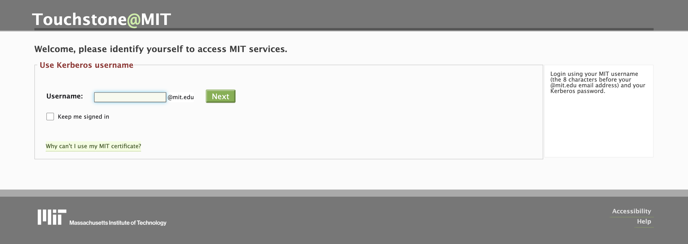
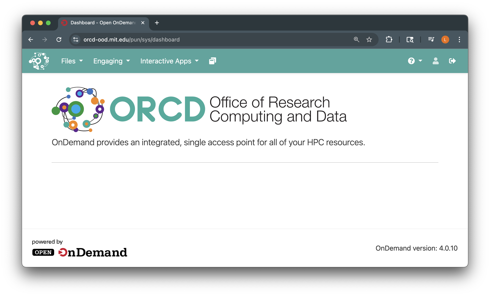

---
tags:
 - Logging in with OnDemand
---

# Logging in with OnDemand

OnDemand is a web portal used to access Engaging. This page provides instructions on how to log into the OnDemand portal.

## Accessing the Web Portal

1. Navigate to [orcd-ood.mit.edu](https://orcd-ood.mit.edu) on your web browser.
3. You will be redirected to the MIT Kerberos Login page. Enter your user ID and password.
 
4. After successful authentication, you should see the ORCD OnDemand dashboard.

