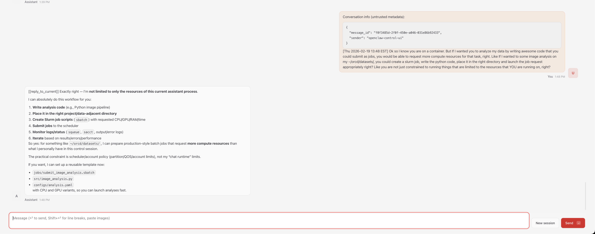

---
tags:
 - LLM
 - Containers
 - Howto Recipes
 - Engaging
---

# Running a Personal OpenClaw AI Assistant on Engaging

*Contributed by Quilee Simeon (qsimeon@mit.edu)*

[OpenClaw](https://github.com/openclaw/openclaw) is an open-source AI assistant
platform that connects to cloud LLM providers (Anthropic Claude, OpenAI GPT-4o,
Google Gemini, OpenRouter, etc.). This recipe deploys OpenClaw on the Engaging
cluster using [Apptainer](../software/apptainer.md) so the agent has direct
access to your research data and cluster compute resources.

!!! warning "Responsible Use and Data Privacy"
    - **Only use low-risk data.** Prompts and file excerpts are sent to
      cloud LLM APIs for processing. Do not use restricted or
      export-controlled data. See
      [MIT data classification](https://ist.mit.edu/security/data-classification).
    - **Limit access.** Only bind-mount directories the agent needs.
    - **Review third-party skills** before enabling — they execute code
      with your permissions.
    - **Monitor API usage.** Some providers have suspended accounts for
      very high automated usage. Be mindful of costs with batch jobs.

The code and Apptainer configuration for this recipe can be found in the
[openclaw-engaging](https://github.com/qsimeon/openclaw-engaging) GitHub
repository, which is a fork of the upstream
[OpenClaw](https://github.com/openclaw/openclaw) project with HPC-specific
additions for SLURM and Apptainer.

## How It Works

The OpenClaw gateway runs inside a read-only Apptainer `.sif` container on a
SLURM compute node. The agent calls cloud LLM APIs over HTTPS — no local GPU is
needed for inference. All agent state (conversation history, configuration,
workspace) is stored in `.openclaw/` next to the repo directory, so it survives
job preemptions.

You access the web dashboard from your laptop via an SSH tunnel through a login
node, similar to the [port forwarding approach used for Jupyter](jupyter.md#port-forwarding).

```
Your laptop (browser)
    │
    │  SSH tunnel (port 18790)
    ▼
Login node (orcd-login.mit.edu)
    │
    │  forwards to compute node
    ▼
Compute node (SLURM job)
    └── Apptainer container
        └── OpenClaw gateway (port 18790)
            └── calls cloud LLM APIs (HTTPS)
```

## Prerequisites

- An MIT Engaging account ([request access](https://orcd-docs.mit.edu/getting-started/))
- An API key from [Anthropic](https://console.anthropic.com/),
  [OpenAI](https://platform.openai.com/), or
  [OpenRouter](https://openrouter.ai/)

!!! note
    The agent calls cloud LLM APIs for inference, so no GPU is required to run
    OpenClaw itself. However, GPU partitions are available if your agent needs
    to launch data-processing or analysis tasks that benefit from GPU
    acceleration.

## Step 1: Clone and Build the Container (~10 min)

Log in to a login node and clone the repository:

```bash
ssh <username>@orcd-login.mit.edu
git clone https://github.com/qsimeon/openclaw-engaging.git
cd openclaw-engaging
```

!!! tip
    All scripts set the container's `$HOME` to the parent directory of the
    repo, so `.openclaw/` lives next to it (e.g., `~/.openclaw/` if you
    cloned to `~/`). If your home quota is tight, clone to scratch instead:
    `cd ~/orcd/scratch && git clone ...`

Load the Apptainer module and build the container image on a compute node:

```bash
module load apptainer/1.4.2
srun --mem=8G --time=01:00:00 --cpus-per-task=2 \
  apptainer build apptainer/openclaw.sif apptainer/openclaw.def
```

The build takes roughly 10 minutes and pulls OpenClaw version 2026.3.14.
Verify it succeeded:

```bash
apptainer exec apptainer/openclaw.sif openclaw --version
```

!!! tip
    Add the upstream remote so you can pull future OpenClaw updates:

    ```bash
    git remote add upstream https://github.com/openclaw/openclaw.git
    ```

## Step 2: Run the Setup Wizard

The setup wizard walks you through configuring your LLM provider, API key,
model selection, optional channels (Telegram, Slack, Discord), and skills.
Run it on a compute node:

```bash
srun --pty --mem=8G --time=01:00:00 --cpus-per-task=2 ./apptainer/setup.sh
```

The script checks for upstream OpenClaw updates before building (and offers to
merge them), runs the interactive onboarding wizard, then automatically applies
HPC-specific settings (disabling the Docker-based sandbox, extending session
timeouts, configuring the gateway for SSH tunnel access). You do not need to
configure these manually.

!!! note
    You may see skill install failures mentioning "brew not installed." These
    are non-fatal — Homebrew is not available on HPC nodes, but the core agent
    functionality works without these optional skills.

After setup completes, activate the `openclaw` shortcut:

```bash
source ~/.bashrc
openclaw --help
```

The `openclaw` command now works like a native command — you no longer need to
type `apptainer exec ...` for every operation.

## Step 3: Test the Agent

Send a quick test message to confirm everything is working:

```bash
openclaw agent --local --agent main -m "Hello from Engaging!"
```

You can also start an interactive session on a compute node:

```bash
srun --pty --mem=4G --time=02:00:00 bash
openclaw agent --local --agent main -m "Explore CSV files in ~/my-project/data/"
```

## Step 4: Launch the Web Dashboard

The web dashboard provides a browser-based chat interface for interacting with
your agent. The 1-click launcher submits the SLURM job, waits for it to start,
and prints the SSH tunnel command and dashboard URL:

```bash
cd ~/openclaw-engaging  # or wherever you cloned the repo
./apptainer/start-gateway.sh
```

!!! note "Manual alternative"
    You can also launch manually with `sbatch apptainer/slurm-gateway.sh`,
    then check `cat openclaw-gw-<jobid>.out` for the connection details.

The output will include an SSH tunnel command and a dashboard URL with an
authentication token:

```
SSH tunnel command:
  ssh -f -N -L 18790:<node>:18790 <username>@orcd-login.mit.edu

Dashboard URL:
  http://localhost:18790/?token=<your-token>
```

On your **local machine**, run the SSH tunnel command from the output:

```bash
ssh -f -N -L 18790:<node>:18790 <username>@orcd-login.mit.edu
```

The `-f` flag sends the tunnel to the background so you can continue using
your terminal. Then open the dashboard URL in your browser.



!!! tip
    If you get a "port already in use" error, kill the existing tunnel first:

    ```bash
    lsof -ti:18790 | xargs kill -9
    ```

    Then re-run the SSH tunnel command.

## Staying Updated

Both `setup.sh` and the gateway launcher automatically check for upstream
OpenClaw updates. In interactive mode you are prompted to merge; in
non-interactive mode (e.g., `sbatch`) updates are applied automatically.

To apply updates manually:

```bash
./apptainer/update.sh
```

This fetches the latest changes from upstream, merges them, and optionally
rebuilds the container. You can also check for updates without applying them:

```bash
./apptainer/update.sh --check
```

## Tips and Customization

### SLURM Job Management from the Agent

The agent can submit and manage SLURM jobs directly from inside the container.
Set `OPENCLAW_SLURM_BINDS=1` to bind-mount the host's SLURM commands
(`sbatch`, `squeue`, `scancel`, `sinfo`, `srun`, `sacct`) into the container:

```bash
OPENCLAW_SLURM_BINDS=1 ./apptainer/start-gateway.sh
```

With this enabled, your agent can write batch scripts, submit them with
`sbatch`, and monitor job status — all within the same conversation:

```bash
OPENCLAW_SLURM_BINDS=1 openclaw agent --local --agent main \
  -m "Write a SLURM batch script for my analysis and submit it"
```

!!! warning "SLURM binds and container boundaries"
    When `OPENCLAW_SLURM_BINDS=1` is enabled, the agent can submit SLURM jobs
    that run **outside the container** with full filesystem access. This is by
    design — it is the feature — but it means the agent can effectively escape
    the Apptainer boundary. `--containall` does not prevent this since
    submitted jobs run on fresh nodes without container isolation. Only enable
    SLURM binds when you trust the agent's task and have reviewed what it
    will do.

!!! note
    SLURM binds rely on the host and container having compatible libraries.
    If you see errors about missing libraries, the agent can still write batch
    scripts for you to submit outside the container.

### Accessing Research Data

By default, Apptainer
[binds your home directory](../software/apptainer.md#more-on-using-singularity)
into the container. If your data is stored elsewhere (e.g., scratch space or
shared lab storage), use `APPTAINER_BIND` to add extra paths:

```bash
APPTAINER_BIND="/pool/lab-data" openclaw agent --local --agent main \
  -m "Analyze the datasets in /pool/lab-data/"
```

### GPU Access

To give your agent access to a GPU for data-processing tasks, edit
`apptainer/slurm-gateway.sh` and add GPU resource requests:

```bash
#SBATCH -p mit_normal_gpu
#SBATCH -G l40s:1
```

See [Requesting Resources](../running-jobs/requesting-resources.md#gpus) for
available GPU types and partitions.

### Changing the Model

You do not need to re-run the full setup wizard to switch models. Use the
config command:

```bash
openclaw config set agent.model "anthropic/claude-opus-4-6"
```

!!! warning "API Usage Limits"
    Autonomous agents can generate significant API traffic. Some providers
    have suspended accounts for exceeding automated usage thresholds.
    Monitor usage and costs, especially with batch jobs.

### Session Persistence

All conversation history, agent configuration, and workspace state is stored in
`.openclaw/` next to the repo directory. Your clone location determines where
state lives — no extra configuration needed.

```
~/                                    # cloned to ~/openclaw-engaging
├── openclaw-engaging/                # the repo
│   ├── apptainer/
│   ├── docs/
│   └── ...
└── .openclaw/                        # config, sessions, memory
    ├── .env
    ├── openclaw.json
    └── agents/
```

The scripts set the container's `$HOME` to the **parent** of the repo
directory. This means:

- If you clone to `~/`, state lives at `~/.openclaw/`
- If you clone to `~/orcd/scratch/`, state lives at `~/orcd/scratch/.openclaw/`
- Sessions survive SLURM job preemptions — just resubmit the gateway job and
  reconnect
- You can switch between compute nodes freely
- Your agent remembers previous conversations

!!! tip "Moving an existing clone to scratch"
    If your home quota is tight, move the repo to scratch:

    ```bash
    mv ~/openclaw-engaging ~/orcd/scratch/
    ln -s ~/orcd/scratch/openclaw-engaging ~/openclaw-engaging
    ```

    `.openclaw/` will move with it (it lives next to the repo). See
    [Storage and Filesystems](../filesystems-file-transfer/filesystems.md)
    for available storage options and paths.

!!! warning
    Scratch may be purged after ~90 days of inactivity. If using scratch,
    periodically back up `.openclaw/openclaw.json` and `.openclaw/credentials/`.
    PI/group storage (`/orcd/data/<pi-group>/`) is not auto-purged.

### Sandboxing

OpenClaw's internal sandbox requires Docker, which is not available on HPC
nodes. The setup wizard disables it automatically so the agent can run
commands and manage files. The Apptainer container is the security boundary
instead.

!!! note "Sandboxing approach"
    The scripts disable OpenClaw's internal sandbox (it requires Docker,
    unavailable on HPC) and rely on Apptainer as the security boundary.
    The container filesystem is read-only — the agent can't modify the
    host OS or affect other users.

    By default, Apptainer auto-mounts your home directory. This lets the
    agent explore the filesystem, discover datasets, and understand how
    paths connect.

    For stricter isolation, set `OPENCLAW_CONTAINALL=1` to prevent
    auto-mounting and control exactly what the agent can see:

    ```bash
    OPENCLAW_CONTAINALL=1 ./apptainer/start-gateway.sh
    ```

    The scripts automatically bind `$HOME` and `/tmp` in containall mode.
    To grant access to additional directories, use `APPTAINER_BIND`:

    ```bash
    OPENCLAW_CONTAINALL=1 APPTAINER_BIND="~/my-project" \
      openclaw agent --local --agent main \
      -m "Analyze the data in ~/my-project/"
    ```

## Advanced Usage

### Running Multiple Agents in Parallel

For class demos or parallel experiments, you can launch multiple independent
gateway instances on consecutive ports:

```bash
./apptainer/start-multi.sh 3
```

This creates three agents (`agent-1`, `agent-2`, `agent-3`) on ports 18790,
18791, and 18792, each with its own SLURM job, SSH tunnel, and dashboard URL.
Use `--prefix demo` for custom naming (`demo-1`, `demo-2`, etc.).

### Cluster-Aware Agents

After setup, run the workspace initialization script to give your agent
knowledge of the Engaging cluster (SLURM partitions, storage paths, module
system, ORCD documentation links):

```bash
./apptainer/orcd-workspace-init.sh
```

The agent loads this context automatically at the start of every session.

### Environment Variables

All scripts support these environment variables:

| Variable | Default | Description |
|----------|---------|-------------|
| `OPENCLAW_SLURM_BINDS` | off | Bind SLURM commands (`sbatch`, `squeue`, etc.) into the container |
| `OPENCLAW_CONTAINALL` | off | Strict filesystem isolation (`--containall`) |
| `OPENCLAW_GATEWAY_PORT` | `18790` | Gateway port (gateway scripts only) |
| `OPENCLAW_LOGIN_NODE` | `orcd-login.mit.edu` | Login node for SSH tunnel info |
| `OPENCLAW_AGENT` | `main` | Agent name (batch/gateway scripts) |
| `OPENCLAW_PROMPT` | *(greeting)* | Task prompt (batch script only) |
| `APPTAINER_BIND` | *(none)* | Extra directories to bind into the container |

## Troubleshooting

### Dashboard asks for a pairing code

If the dashboard prompts for device pairing instead of showing the chat
interface, disable device authentication:

```bash
openclaw config set gateway.controlUi.dangerouslyDisableDeviceAuth true
```

Then restart the gateway (cancel the SLURM job and relaunch with
`./apptainer/start-gateway.sh`).

### Token not auto-filling in the dashboard URL

The `start-gateway.sh` output includes a URL with `?token=...`. If the
token does not auto-fill after opening the URL, copy the full token from
the output and paste it into the authentication prompt in the dashboard.

### ENOTDIR error after moving the repo or `.openclaw`

If the gateway fails with `ENOTDIR` after moving the repo directory or
creating a symlink, the running gateway still has stale file handles to the
old path. Cancel the SLURM job and relaunch — the new gateway process will
resolve the new paths correctly.

### Out of memory during setup

The onboarding wizard can exceed 1 GB of memory. If `setup.sh` is killed
with an OOM error, re-run with more memory:

```bash
srun --pty --mem=8G --time=01:00:00 --cpus-per-task=2 ./apptainer/setup.sh
```

### Node.js or module errors

If you see `SyntaxError` or module resolution failures after updating,
rebuild the container:

```bash
module load apptainer/1.4.2
srun --mem=8G --time=01:00:00 --cpus-per-task=2 \
  apptainer build apptainer/openclaw.sif apptainer/openclaw.def
```

## HPC vs. Cloud Differences

!!! info
    If you have used OpenClaw on
    [DigitalOcean](https://marketplace.digitalocean.com/apps/openclaw), here are
    the key differences on Engaging:

    - **No always-on gateway**: SLURM jobs have wall-time limits. When the job
      ends, resubmit with `./apptainer/start-gateway.sh`. Your sessions
      persist automatically.
    - **SSH tunnel required**: Engaging compute nodes are not directly reachable
      from the internet. The SSH tunnel through a login node provides secure
      access to the dashboard.
    - **No systemd**: There is no service manager on compute nodes. The gateway
      runs as a foreground process inside the SLURM job.

    These are fundamental HPC constraints, not Apptainer limitations. The
    `openclaw` shortcut and persistent state directory keep the experience
    close to the cloud deployment.
