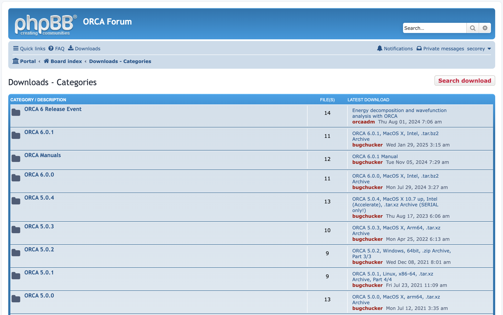
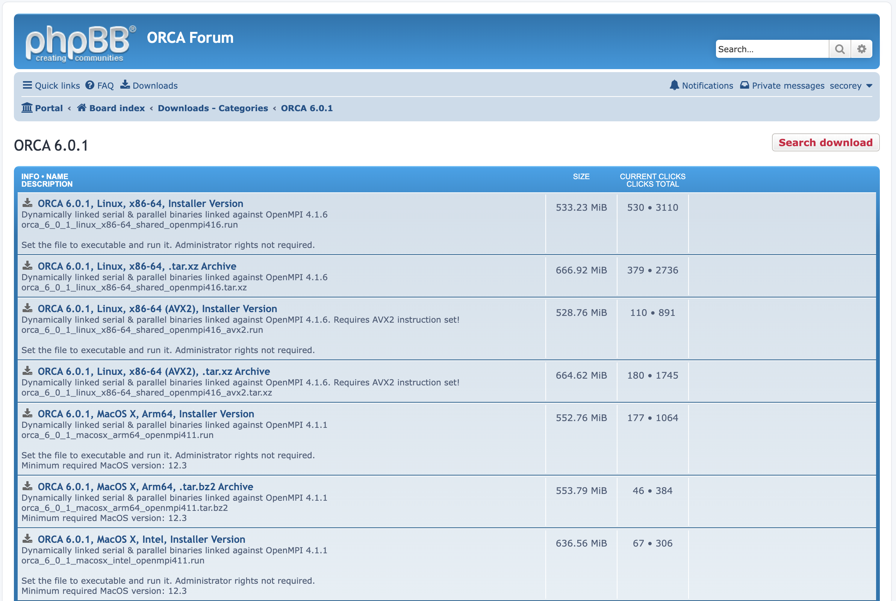
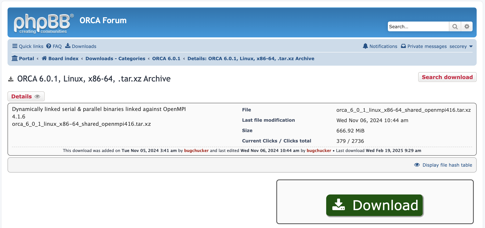

# Installing ORCA for Personal Use

ORCA is a licensed software that is free for academic use, but it cannot be
transferred to third parties (per the ORCA EULA). So, we cannot install newer
versions system-wide. Users must create an account and install it personally.
Here are the steps to do so:

- Navigate to the [ORCA website](https://orcaforum.kofo.mpg.de/app.php/portal)
- Register for an account and login
- Click "Downloads" in the top bar


- Select the version of ORCA you want



- Select the "Linux, x86-64, .tar.xz Archive” version



- Click "Download"



- Upload the `.tar.xz` file to Engaging using `scp`:

```bash
scp /path/to/orca_6_0_1_linux_x86-64_shared_openmpi416.tar.xz $USER@orcd-login001.mit.edu ~/
```

- On Engaging, extract the `tar.xz` file:

```bash
tar -xf orca_6_0_1_linux_x86-64_shared_openmpi416.tar.xz
```

- Add this version of ORCA to your path:

```bash
export PATH=/path/to/orca_6_0_1_linux_x86-64_shared_openmpi416:$PATH
```
