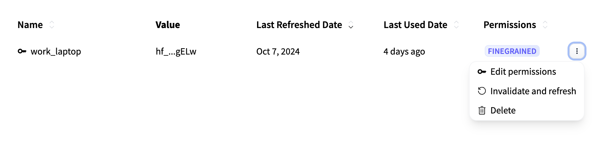

---
tags:
 - LLM
 - GPU
 - Howto Recipes
 - Engaging
---

# Running Your Own Retrieval-Augmented Generation (RAG) Model

RAG models harness the power of Large Language Models (LLMs) to query and
summarize a set of documents. Through RAG, one can combine the strengths of
retrieval-based and generative models to provide more accurate and contextually
relevant responses.

RAG also provides an interesting test case to make use of our resources on the
cluster. Here, we provide instructions on how to run a RAG model to query and
answer questions about [our ORCD documentation](https://orcd-docs.mit.edu/).

The code for developing this model can be found in this
[GitHub repository](https://github.com/mit-orcd/orcd-rag). Feel free to use
this repository as a guide to develop your own RAG model on separate
documents.

## Getting Started

### Working on a Compute Node

You will need to request an interactive session with a GPU:

```bash
salloc -N 1 -n 8 -p mit_normal_gpu -G l40s:1
```

I have specified an L40S GPU, which has 48GB of memory. You will need a GPU with
at least 40GB of memory to use the 8B model.

### Getting Access to HuggingFace

The LLMs used in this pipeline are from HuggingFace. By default, we use a model
from Mistral, which is gated and requires users to request access. You can
follow this process for doing so:

1. [Create a HuggingFace account](https://huggingface.co/)
2. Request access to [mistralai/Ministral-8B-Instruct-2410](https://huggingface.co/mistralai/Ministral-8B-Instruct-2410)
3. Create a [user access token](https://huggingface.co/settings/tokens)

    You will need to adjust the settings of your user access token so that you
    can download and run the model. To do so, navigate to your HuggingFace
    profile, then click "Edit Profile" > "Access Tokens" and edit the
    permissions for your access token:

    

    Edit your token permissions to match the following:

    

4. Export your access token as an environment variable on Engaging and add to
your `.bash_profile` so it can be saved for future uses:

    ```bash
    export HF_TOKEN="your_user_access_token"
    echo 'export HF_TOKEN="your_user_access_token"' >> ~/.bash_profile
    ```

    !!! note
        You will not be able to copy your HF token again from the HF website. If
        you do not save it somewhere, you will need to generate a new one every
        time you run this.

## Running the Model

### Running in a Container

You can run the RAG model on our documentation using the Apptainer image we have
saved to Engaging. We have the commands for doing so saved in a
[shell script](https://github.com/mit-orcd/orcd-rag/blob/main/container/run_rag_with_container.sh).
To run the container, you can simply run the following:

```bash
sh /orcd/software/community/001/pkg/orcd-rag/container/run_rag_with_container.sh
```

The first time you run this, the model will be downloaded from HuggingFace and
cached, so it may take a while to get running. Subsequent times will be much
quicker because the model has already been downloaded.

The 8B model takes about 15GB of space. The default cache location for
HuggingFace models is `$HOME/.cache/huggingface`. If you do not have enough
space in your home directory to store the model, you can set the `HF_HOME`
environment variable to point to another directory. For example, to save models
to your scratch directory (depending on your storage setup), that would look
something like this:

```bash
export HF_HOME=/home/$USER/orcd/scratch
```

or:

```bash
export HF_HOME=/nobackup1/$USER
```

### Running via a Python Environment

You can avoid the container route and run this using a Python environment. This
method is recommended if you would like to make any advanced changes to the
pipeline. The steps to do so can be found on this
[GitHub repository](https://github.com/mit-orcd/orcd-rag).

## Customization

To customize this pipeline to fit your needs, aside from editing the
[code base](https://github.com/mit-orcd/orcd-rag) itself, you can use the
provided optional flags when you call the script. To see what customizations are
available, use the `--help` flag:

```bash
sh /orcd/software/community/001/pkg/orcd-rag/container/run_rag_with_container.sh --help
```

This will allow you to adjust model temperature, change the path to use a
different set of documents, use a different LLM (doing this successfully will
likely take some editing of the code base), or pass a set of queries to run
in a batch setting.

### Using Your Own Documents

Be default, the pipeline is set up to run RAG on the
[ORCD documentation](https://orcd-docs.mit.edu/). However, this is designed to
be easily adaptable to any set of documents you choose.

If you have created a vector store of documents, you can specify the path to
those documents when you run the pipeline using the `--vector_store_path` flag:

```bash
sh /orcd/software/community/001/pkg/orcd-rag/container/run_rag_with_container.sh --vector_store_path /path/to/vector/store
```

#### Creating a Vector Store

The RAG pipeline requires that documents be stored in a vector database ("vector
store"), so that relevant information can be queried efficiently. We have
included code for creating a vector store based on `.md` or `.pdf` files. First,
you will need to consolidate your documents into a single directory and
[upload them to Engaging](../filesystems-file-transfer/transferring-files.md#scp).
Then, run this command, specifying the path to your directory of documents:

```bash
sh /orcd/software/community/001/pkg/orcd-rag/container/create_vector_store_with_container.sh --docs_dir /path/to/documents
```

This will create a vector database located at `~/.cache/orcd_rag/vector_stores/<docs name>_vector_store`.

!!! note
    Large files (especially PDFs) may need to be split into smaller files to
    avoid exceeding memory limits on the GPU.
