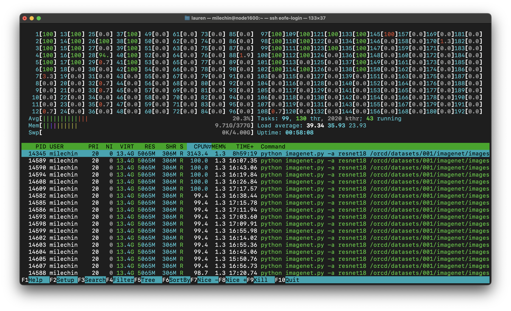
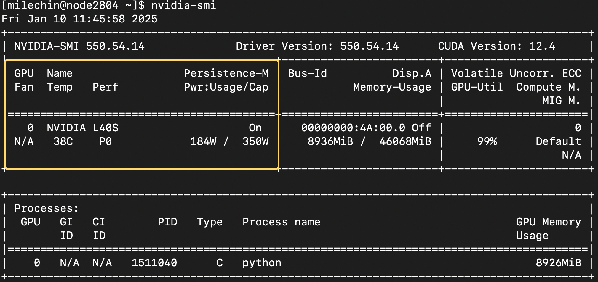
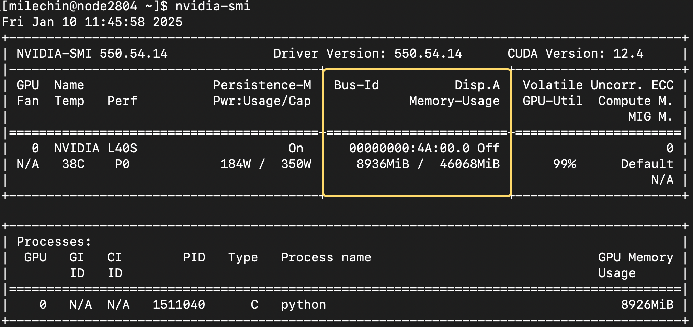
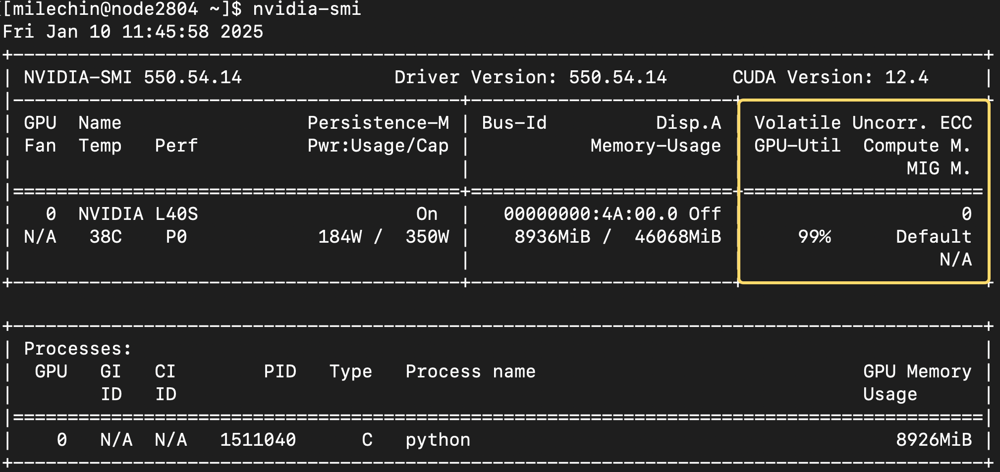
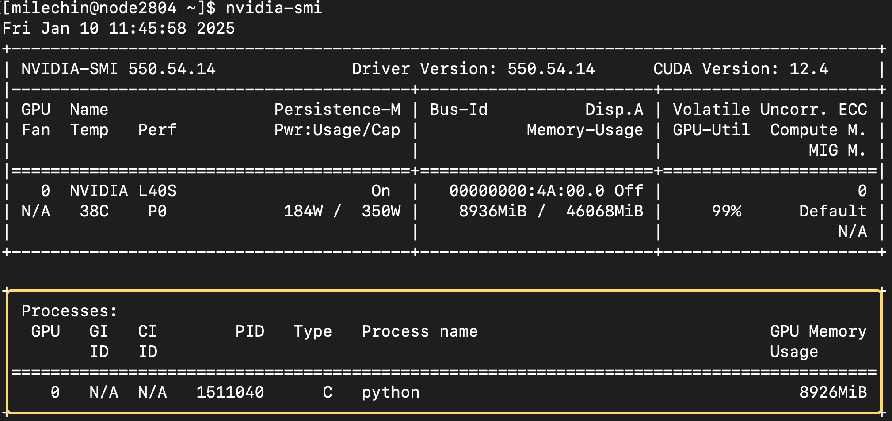

# Analyzing Job Resource Usage
Here we provide an overview for how to analyze the resources your jobs use, utilizing the commands ```htop```, ```nvidia-smi```, and ```nvtop```. Using these tools are important for both optimizing your code and only requesting the amount of resources your jobs need, leaving more resources open for others to use. A good place to start before using the commands we outline in this doc is with the ```sacct``` command, and its documentation can be found [here](https://orcd-docs.mit.edu/running-jobs/requesting-resources/#memory).

## htop

You can get a lot of information about your running jobs through the ```htop``` command. It sort of gives you a way to watch the compute node your job is running on work on your job. It will show you your current instantaneous CPU and Memory utilization, how many cores are being used, how many threads are running, a list of your processes running on the node, among other things. If you are familiar with the top Linux command it is similar but shows more information.

### How to Run htop

The key thing to know is you need to run the ```htop``` command on the node where your job is running. First, get the name of the node your job is running on. You can do this by running the ```squeue --me``` command. The last column has the node name. If you are running in an interactive job the node name will also be at your command prompt.

The next step is to ssh to the node where your job is running. Run the command ```ssh NODENAME```, where NODENAME is the name of the node you just found. If you are running an interactive job, open a new terminal tab or window and log into Engaging. Note that you can only ssh to nodes where you have a job running, and you should exit the node once you are done monitoring your job with the exit command.


In the above image, you can see we have run ssh node1600, and the command prompt now indicates we are on that node. From here we can run:

```htop -u USERNAME```

where USERNAME is your username. Specifying your username filters out processes that don't belong to you and makes it easier to interpret the output.

### Using htop

The following is a screenshot of the htop program.



The first thing you'll notice when you run htop yourself is it is constantly moving to give you instantaneous statistics. There are two main sections in the htop output. The bottom half shows the processes running on the node and the top half shows the activity on the node. Note that by specifying your username you will only see your processes, but the activity in the top half may reflect processes running on the node that aren't yours, so if you want an accurate representation of your job you may want to request a full node.

If you are on a node with a lot of cores it may be difficult to see the full output. You can set htop to use a more compact visualization by creating a config file. First create the directory ~/.config/htop if it doesn't already exist. Download [this file](https://courses.llx.edly.io/assets/courseware/v1/2d43cbc80df72f512dea5fa5dd05e89e/asset-v1:llx+MITORCD10+Self-Paced+type@asset+block/htoprc) and put it in the ~/.config/htop directory. The file should be named htoprc.


In the top half you'll see numbered bars with percentages. These represent the cores on the node. You'll see twice the number of bars as cores. This is due to hyperthreading: each physical core has two "virtual" cores. This display gives you a rough idea of how hard the cpus on the node are working. If a CPU is at 100%, it is fully utilized. If there isn't much activity, not much is going on on the node. If you are expecting multiple processes or threads to be working, and you only see one bar fill up, you have an indication that you might need to change a setting. Alternatively, maybe you haven't explicitly asked your program to use multiple cores and you expect it to use only one, but you see multiple CPUs at 100%, even when you are the only person on the node. In that case you may need to tell the package you are using how many threads or cpus to use.


In the top half you'll also see a bar labeled "Mem" under the CPU bars. This is the instantaneous memory usage on the node.  Note that just because you see a certain number here while you are watching doesn't mean this is the maximum memory your job will use. To get that information you'll want to use the [sacct](https://orcd-docs.mit.edu/running-jobs/requesting-resources/#memory) command.


Next to the "Mem" bar you'll see some text labeled "Tasks". This lists running processes (tasks), threads, and running processes or threads. You generally don't want more running processes or threads than the number of cores on the node. Again, this number may reflect another user's  threads or processes running on the node. In the screenshot above it shows that there are 43 running threads. I requested 16 cores for the job, and with hyperthreading the application created 32 threads. There was another user running on the node who was running their own job that added a few more threads.


Below the "Tasks" is a line that shows "Load average". It shows three numbers: the load average for the past 1, 5, and 15 minutes. The load is roughly the number of running processes, the load average over the last X minutes. This number is somewhat related to CPU utilization, as each CPU is realistically capable of running a single process at a time. It therefore gives you roughly a single-number condensed view of the CPU utilization image at the top. If this number is high in relation to the number of cores on the node, then you know those cores are working hard. If for some reason this number is over the number of cores, you are likely overworking the node and should scale back on the number of threads or processes you have running on that node. Engaging is configured to prevent this, but it is a good thing to keep an eye on. You will may find with fewer threads or processes your application will actually run faster in this case, as they are no longer competing for resources.


Now let's take a quick look at the bottom half. As mentioned above, this shows all of your processes and threads running on the node. You can see the PID (process ID), username (you'll only see your own processes), state, CPU utilization %, memory usage %, and the command that initiated the process, among other things. Clicking on the different headers re-sorts the list by that column, here I have it sorted by CPU%. In this case I started one Python process and that Python application created many threads. The main process happens to be at the top in this case, since I have it sorted by CPU%. When you have a multithreaded application, the CPU usage for the individual threads is included in the number for the main process. Each thread is currently using about 100% of a CPU (100% is full usage of a single CPU), so the total for the entire application is 3092%, meaning my application is using the equivalent of 30-31 full cores across all its threads. So even though I have 43 total running threads and/or processes, they aren't all using the full power of a CPU. All of the numbers on this bottom chart are instantaneous, rather than an average, but you can see the CPU% for the main task matches up somewhat with the load average above, when taking into account another user running on the node.

## nvidia-smi

The nvidia-smi command is useful for evaluating how your GPU-accelerated applications are making use of the GPU(s) that they are using. It will give you information about GPU utilization, GPU Memory utilization, and processes using the GPU.

### How to Run nvidia-smi
Like htop in the previous unit, you must be on the same node as your job to run nvidia-smi to monitor it. Further, because it is a GPU utility, if you try to run nvidia-smi on a node without a GPU you will get a command not found error. And, similar to htop, you will only see statistics for the GPU(s) you have allocated to your job, so if you are on a node with GPUs but didn't request any, you won't see any listed. For more information about how to request GPUs for your job, see the pages on [Requesting Resources](https://orcd-docs.mit.edu/running-jobs/requesting-resources/#gpus) and [Scheduler Overview](https://orcd-docs.mit.edu/running-jobs/overview).


First, get the name of the node your job is running on. You can do this by running the ```squeue --me``` command. The last column has the node name. In the image below you can see the node name, node2804, in the last line of the squeue output. The next step is to ssh to the node where your job is running. Run the command ssh NODENAME, where NODENAME is the name of the node you just found. If you are running an interactive job, open a new terminal tab or window and log into Engaging and ssh to the node from there. Note that you can only ssh to nodes where you have a job running, and you should exit the node once you are done monitoring your job with the exit command.


In the above image, you can see we have run ssh node2804, and the command prompt now indicates we are on that node. From here we can run the nvidia-smi command as shown.

### Using nvidia-smi

When you run nvidia-smi you will get a single snapshot. If you would like this to continuously refresh, which is a bit more useful in practice, you can use the -l flag, which prints a refresh to the screen at a regular interval. By default this interval is 5 seconds, or you can specify an interval yourself. For example, if you want it to refresh every 10 seconds you would run ```nvidia-smi -l 10```. Pressing Control+C on your keyboard will stop the continuous refresh.


Similar to htop, the top half of nvidia-smi shows you information about the GPU(s), the bottom half lists the process(es) using them.



The first box, circled above, tells you about the GPU, its state, and some of its physical properties. You can see the GPU name (L40S), its current temperature (38C), and current power usage and power cap (using 184W, capped at 350W). This is more informational than anything, but knowing how much power your GPU is using might be something you want to think about, especially if you are using them often.



The most useful part of the second box is the memory usage. It shows both the memory you have used (roughly 8.9GB here) and the total memory on the GPU, 46GB.



The final box at the top shows the GPU utilization. You can think of this as how much you are making use of the GPU. You want to aim for 100% utilization, that is when you are getting the most out of it. If your utilization is low and if the memory allows, you may want to give the GPU more data to work on. You could also train multiple models on the same GPU. If your GPU utilization is low, it may also be a sign that your application doesn't have enough work for the GPU to do, and you should check the speedup you are getting with the GPU vs CPUs. If it is modest, say 2x or 4x, then it isn't worth using GPUs and you can likely get more performance by scaling out to more CPUs.



The final table at the bottom shows the process(es) running on the GPU(s) you have allocated. You'll have the GPU number in the first column. If you have asked for one GPU this will always be a "0". Type refers to whether the process is a compute (C) or graphics (G) task. You'll have the Process Name, which will be "python" if you are running a python script as seen here. The last column shows the GPU Memory Usage.


## nvtop
```nvtop``` is like ```htop```, except for monitoring GPU usage. It enables you to see the real-time statistics of your job on the GPU, including memory, compute, and power consumption.

### How to Run nvtop

The principles of usage are very similar to that of htop, and here we will outline them. ssh into the node on which you are running a job using a GPU (```ssh NODENAME```) and run ```nvtop```. You can refer to the htop section [above](#how-to-run-htop) for more details on the ssh process. After running nvtop, you will see your usage updating in real time. Below we show an example of using this to monitor the GPU usage of [RAG](https://orcd-docs.mit.edu/recipes/rag/). If you don't yet have a GPU application and would like to get a sense of how to use nvtop, RAG could be a good example to start with. 


In the first image above, we have only loaded the model and have not yet asked a prompt which kicks off computation. As we expect, we see that the model takes considerable memory, but the compute of the GPU is not being used. 


In the second image above, we see the results of nvtop when we have queried the RAG model, and therefore started computation on the GPU. We see that the GPU compute is now being at 99%. We can also see that the power and temperature of the system have shot up.Normally at this step, you would evaluate whether you want to request more or less memory in the future and whether the job can be modified to use the GPU's compute more efficiently.