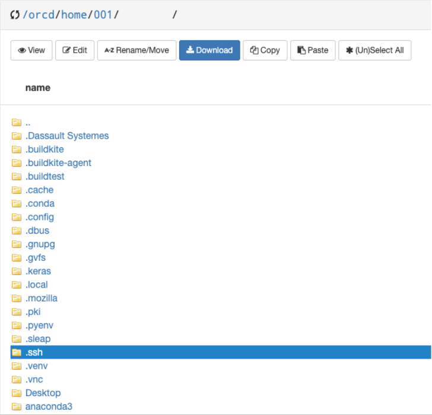
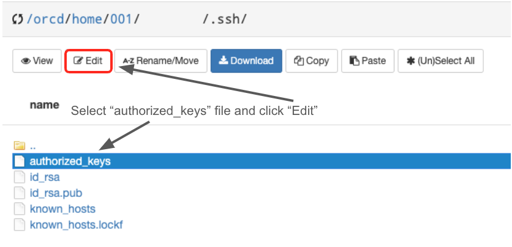

---
tags:
 - SSH Setup
---

# SSH Setup

An SSH key is a secure access credential used in the SSH protocol and establishes a secure and encrypted connection to our HPC systems. This page is for those who wish to implement SSH key authentication on top of general MIT Kerberos authentication.

## Checking for Existing SSH Keys

Before you generate an SSH key, you should check for existing SSH keys.  

1. Open your local terminal.  
2. Run the following command to view all existing SSH keys:  
```bash
ls -al ~/.ssh
```
3. If you see a list of files, you have existing SSH keys.
If you receive an error that ~/.ssh doesn't exist, you do not have an existing SSH key pair in the default location. You can create a new SSH key pair in the next step.

## Generating SSH Keys

If you do not have an existing SSH key, follow these steps. 

1. Open your local Terminal.  
2. Run the following command to generate an RSA key:  
```bash
ssh-keygen -t rsa
```
3. **Save the key pair:** You will be prompted to enter a file path to save the key. Press `Enter` to accept the default location:
```
Enter a file in which to save the key (/home/your_username/.ssh/id_rsa):
```

4. **Passphrase:** 
You will be asked to enter a passphrase for additional security. You can either enter a passphrase or leave it empty and press `Enter`:
```
Enter passphrase (empty for no passphrase):
```
!!! Note 
    **The passphrase for your SSH key is not stored or known by us, so it is crucial to remember it, as we cannot recover it if forgotten.**


## Uploading SSH Key on Our Systems

To upload your SSH key on our systems, you must update the `authorized_keys` file in the respective system via terminal. Alternatively, for the Engaging System, you have the option to use OnDemand, and for SuperCloud, you can fill out an SSH key addition form.

=== "Terminal"
    To add your SSH key via Terminal, please follow the steps outlined below:

    1. Login to an HPC system login-node using MIT Kerberos Login.
    2. On your local machine, copy the contents of your public key (`~/.ssh/id_rsa.pub`):
    ```shell
    cat ~/.ssh/id_rsa.pub
    ```
    > Make sure to copy the entire line starting with ssh-rsa and ending with your email address or comment. 
    3. On the head-node, append the copied contents to the authorized_keys file located at `/home/[username]/.ssh/authorized_keys`. You can use any text editor of your choice, such as nano and vim. For example, if you're using `nano`, the command would be:
    ```shell
    nano /home/[username]/.ssh/authorized_keys
    ```
    !!! Note
        **Do not remove anything already present in the authorized_keys file. Be careful to append your key to the end of the file rather than replacing its contents.**

=== "Engaging OnDemand"
    To add your SSH key to Engaging via OnDemand, please follow the steps outlined below:

    1. Login to Engaging OnDemand through the [portal](https://engaging-ood.mit.edu/).
    2. Once logged in, navigate to `Files` and `Home Directory`.
    3. On the top right corner, check `Show Dotfiles`.
    
    4. Click on the `.ssh` folder.
    
    5. Locate and edit the `authorized_keys` file to add your new key.
    

    !!! Note
        **Do not remove anything already present in the authorized_keys file. Be careful to append your key to the end of the file rather than replacing its contents.**

=== "SuperCloud"
    To add your SSH key to SuperCloud, please follow the steps outlined below:

    1.  Navigate to the [SuperCloud SSH Key Addition Form](https://supercloud.mit.edu/requesting-account#adding-keys) and follow the instructions to add your SSH key. 
    2. If you encounter any problems during the SSH key submission process, refer to the [SSH Troubleshooting Checklist](https://mit-supercloud.github.io/supercloud-docs/ssh-troubleshooting-checklist/) for guidance. 

## Testing your SSH Key Setup

To ensure that your SSH key is correctly configured, follow these steps:

1. Attempt to login on your terminal: ssh your_username@cluster_address
2. If prompted for a password, the SSH key setup did not work. Recheck the steps and correct any issues.

## Troubleshooting SSH Key Issues
If you encounter SSH key issues, you can reference the [SSH Troubleshooting Checklist](https://mit-supercloud.github.io/supercloud-docs/ssh-troubleshooting-checklist/). While this guide is for SuperCloud, it should be helpful for other systems as well. If you are still having problems, please email us at orcd-help@mit.edu and visit the [Getting Help](https://orcd-docs.mit.edu/getting-help/) page.

