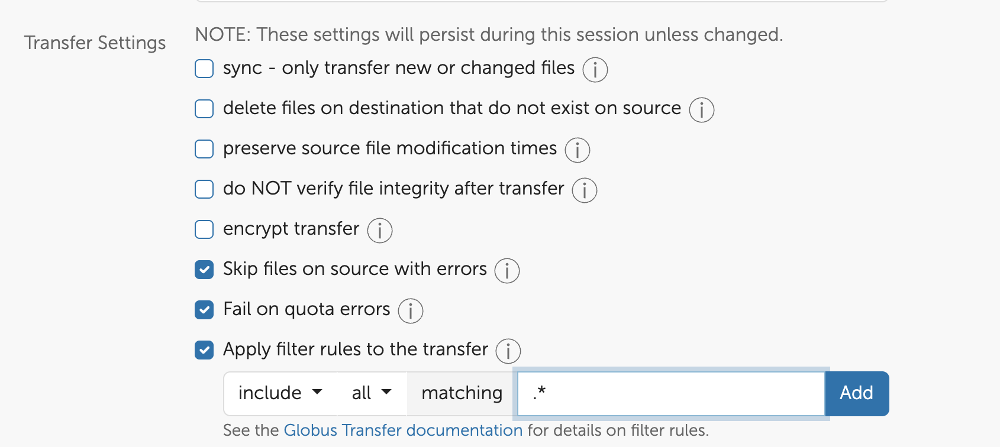

# Satori to Engaging Transition Guide

Satori will be retired at the end of October. Engaging has many GPUs available and we encourage all Satori users to migrate their work to Engaging. The ORCD team is here to help make that transition as smooth as possible.

This page is maintained to answer questions and document how to migrate to ORCD's Engaging system.

## Frequently Asked Questions

### What is the timeline?

- October 15: Home and nobackup storage on Satori made read-only
- October 31: Satori retired

### How do I migrate to another system?

There are three main steps or milestones for moving to a new system. These will be similar to the steps you take when getting a new account on any system.

- Transfer data: Identify what data you need to keep and transfer it to the new system. See the [Migrating Data from Satori](#migrating-data-from-satori) section below for recommended ways to transfer large amounts of data.
- Build any missing software: Check the software stack of the new system and see what you may need to rebuild or request. Engaging maintains a software stack through modules that includes many of the software packages provided on Satori. Names may be different, so run `module avail` to check for differences.
- Run jobs: Run small tests before running larger production jobs. Both Satori and Engaging use Slurm, but have different partition names. Some `sbatch` flags may differ between the two systems as well. You can also consult the section on [Running Jobs](running-jobs/overview.md) in this documentation.

### Where can I get help?

The ORCD team can help with migrating data and workloads to Engaging. ORCD has regular office hours (see the [Office Hours Schedule](https://orcd.mit.edu/news-and-events/office-hours)). You can also request help through <orcd-help@mit.edu>.

### How can I get an account on Engaging?

It is fairly quick and simple to create your account Engaging. Accounts on the engaging cluster are connected to your MIT institutional Kerberos id. To get an account log into the [Engaging OnDemand Web Portal](https://engaging-ood.mit.edu). Connecting to Engaging OnDemand for the first time automatically activates an account with basic access to resources. See [this page](accessing-orcd/ondemand-login.md) for instructions on how to log in. After you log in wait a few minutes for your account setup to complete before starting to run jobs.

### My group has our own partition on Satori, what will happen to those nodes?

There are three group partitions on Satori with newer nodes purchased by MIT PIs. These nodes will be migrated to Engaging. Any NESE storage will also be re-mounted on Engaging.

### How can I use my Python virtual environments or Conda environments on Engaging?

If you have [Python virtual environments](software/python.md#python-virtual-environments) or [Conda environments](software/python.md#conda-environments) on Satori that you would like to use on Engaging, we recommend recreating them on Engaging. Simply copying over environment files is **not expected to work** due to setup differences between the two clusters.

For both types of environments, the general process is to save the environment specifications to a yaml or requirements.txt file to be used to recreate the environment on Engaging.

!!!note
    For more information on using Python on Engaging, see our
    [Python documentation](software/python.md).

#### Python virtual environments

Save contents of python venv to a `requirements.txt` file:

```bash
module load anaconda3
source /path/to/my_venv/bin/activate
pip freeze > my_venv_requirements.txt
```

Transfer file to Engaging:

```bash
scp my_venv_requirements.txt <username>@orcd-login001.mit.edu:/path/to/dest
```

On Engaging, your `requirements.txt` file should now appear in the directory you specified. Recreate it with the following commands:

```bash
module load miniforge
python -m venv my_venv
source my_venv/bin/activate
pip install -r my_venv_requirements.txt
```

!!!note
    The Python version in Satori's Anaconda module is different than the
    version provided by the Miniforge module on Engaging. If this is a problem,
    we recommend creating a Conda environment with your desired version of
    Python installed.

#### Conda environments

You can check all Conda environments you have created using `conda info --envs`.
As Conda environments can take up lots of space, we recommend going through and
choosing to transfer only the environments that you are still using.

For each Conda environment you'd like to transfer, take the following steps:

On Satori:

```bash
module load anaconda3
conda activate my_env
conda env export --no-builds | grep -v "^prefix: " > my_env.yml
```

Transfer `.yml` file to Engaging:

```bash
scp my_env.yml <username>@orcd-login001.mit.edu:/path/to/dest
```

Recreate environment on Engaging:

```bash
module load miniforge
conda env create -f my_env.yml
```

## Migrating Data from Satori

This section describes some recipes for migrating data from Satori to Engaging, but some advice will apply to other systems.

### Step 1: What to Transfer

First, this is a good opportunity to decide what you need and what you don't need. Take a look at your home and nobackup directories and decide what you need to keep. Transferring a lot of data (more than a few TB) or files (order of 1 million files) can take a long time. 

!!! warning "Remove files carefully"
    Remove files you no longer need very carefully. Remember, `rm` on Linux is permanent and the Satori storage is not backed up!

### Step 2: Where to Transfer

Next figure out where you are going to transfer the data. Engaging has some base storage [described here](filesystems-file-transfer/filesystems.md), with additional [storage available for purchase](filesystems-file-transfer/project-filesystems.md).

For long-term archival storage of data that you need to keep, but will never or rarely need to access, consider purchasing archival storage such as [AWS Glacier](https://aws.amazon.com/s3/storage-classes/glacier/). For storage that you may need to access, but don't need to compute, [MIT IS&T provides some storage options](https://kb.mit.edu/confluence/display/istcontrib/Data+Storage+and+Collaboration+Options) for MIT students, staff, and faculty.

### Step 3: Transfer Your Data

If you don't have a lot of data to transfer you can use `scp` or `rsync` to transfer files at the command line. Log into either system and run your `scp` or `rsync` command from there. The best option is to do this on the download partition on Satori as a batch job. You would use a batch script that looks something like this:

```bash title="transfer.sh"
#!/bin/bash

rsync -ruP path/to/source USERNAME@orcd-login001.mit.edu:/path/to/destination/satori-files/
```

!!! warning "Do not directly copy Satori home into Engaging home"
    Be careful not to copy your Satori home directory directly into your Engaging home directory. Doing so may overwrite files in your Engaging home directory, including files such as `.bashrc` which can cause issues. Instead create a subdirectory and transfer your files there.

If you have a lot of data and are having trouble with `rsync` or `scp` failing before the transfer is complete, Engaging and Satori have Globus collections that can make transfer easier. Globus will manage the file transfer for you to make sure everything transfers properly.

#### Using Globus to Transfer Data

Both Engaging and Satori have Globus collections that you can use to migrate your data.

To initiate the transfer go to [https://www.globus.org/](https://www.globus.org/), log in, and click "File Manager".

In the left pane search for the [mithpc#satori](https://app.globus.org/file-manager?origin_id=4841ad03-4878-4d3a-bb58-babb32074cef) collection. In the right pane search for the [MIT ORCD Engaging Collection](https://app.globus.org/file-manager?destination_id=ec54b570-cac5-47f7-b2a1-100c2078686f) collection.

If you need help finding the target directory on Satori or Engaging with Globus send an email to <orcd-help@mit.edu> or stop by [office hours](https://orcd.mit.edu/news-and-events/office-hours) and we can help you.

Once you have selected your target collection navigate to the directory where you want to transfer your data. Create a directory called "Satori" and select it.

Select the items you want to transfer from Satori in the left pane, or "Select all" to transfer your entire home directory. Symlinks (to group directories) and their contents are not transferred.

!!! hint "Deselect dot . files"
    Click "Show Hidden Items" to deselect . files. Your .bashrc and any conda environments will not work on another system and could cause issues.


Under Transfer and Timer options select:

- Skip files on source with errors
- Fail on quota errors
- Encrypt transfer
- Consider:
    - Excluding dot files (ex: .bashrc). Check "Apply filter rules to the transfer" and set to exclude all matching `.*` (see screenshot below)
    - Sync, This is helpful if you've already transferred files and only want to transfer new files



Once you have selected your source files, destination, and transfer settings click the "Start" button on the left pane (the Satori side). You can view the transfer progress on the "Activity" page, and Globus will send you an email when the transfer is done.
